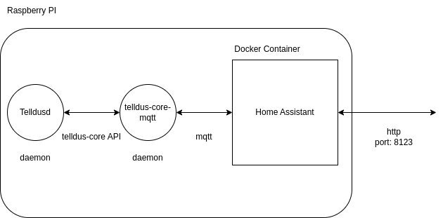

# Tellstick Love

## Introduction

Tellstick Love is a yocto image for the Raspberry 3 model B and the Tellstick Duo (which is a 433 Mhz control unit from the former company Telldus).
It is built around a number of software modules/programs running on a Rasberry PI 3:

* telldus daemon (telldusd) to control the Tellstick Duo
* telldus-core-mqtt (an mqtt client, publishing telldus devices in the MQTT> broker)
* the mosquitto MQTT broker
* home assistant as container, configured as below in "How to Build and Configure"

## System Architecture

## How to Build and Configure

First create a virtual python environment:
> python -m venv venv
> pip install -r requirements.txt

Set the hashed password in tellsticklove-image.bb. Remember '$' shall have a proceeding backslash '\' i.e. \$.
> mkpasswd -m SHA-512
> vi ./meta-tellsticklove/recipes-core/images/tellsticklove-image.bb

Build the yocto image using kas:
> kas build config.yml

Flash the yocto image to your 32 GB SD Card. Right now it is configured for this size.
> sudo ./flash.sh

Login into the device using ssh (for X and YYY - see your dhcp in your router):
> ssh telldus@192.168.X.YYY

Edit the tellstick.conf file and add your switches and temperature sensors:
> vi /etc/tellstick.conf

Create the Home Assistant container:
> home-assistant.sh create

Wait for quite a while....

Once finished:
> reboot

Either do the following:

Log into home-assistant:
* Set login and password.
* Set city.
* Set date & time format in profile.
* Add MQTT integration. Use loop-back (127.0.0.1) as broker since Mosquitto already running.
* Verify that the devices are discovered.
* Create a label for the  switches.
* Create four automations: EveningTurnOn, EveningTurnOff, MorningTurnOn, MorningTurnOff.

or:

* Import a backup file (.tar) from a previous setup of home assistant.

## Questions?
[Frequently Asked Questions](FAQ.md)
